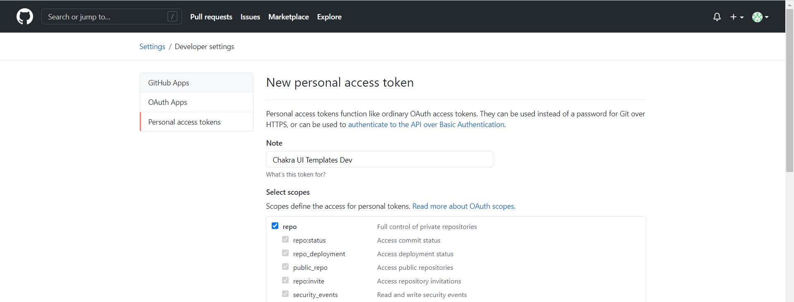

# Contributing

> Thank you for your interest to contribute to Chakra Templates. You are awesome!

## Setup the Project

1. Fork this repository
1. Clone your fork to your local machine

   ```bash
   git clone https://github.com/<your_github_username>/chakra-templates.git
   cd chakra-templates
   ```

1. Install all dependencies by running `yarn install` in your terminal

To fetch the current github stargazers count during development it is necessary to create a `.env.development.local` file with a [GitHub
access token](https://github.com/settings/tokens/new?description=Chakra+Tempaltes+Development) inside.

Make sure the token permissions look like this



In other words ✅ in the **repo** checkbox and then click on **Generate Token**

```txt
GITHUB_TOKEN=YOUR_TOKEN_HERE
```

## Development

### Commands

`yarn dev`: run the Next.js dev command. Visit [http://localhost:3000/](http://localhost:3000/) to see the local environment

`yarn build`: run the Next.js build command

`yarn start`: run the Next.js start command

`yarn lint:ts`: lint all the files regarding typescript errors

`yarn test:watch`: run jest in watch mode,

`yarn test:ci`: runt jest in CI mode

## Adding a new Template

Adding a new template can be archived within 2 simple steps.

1. Update the data in `src/data/index.ts`

   > This is the main data source of the website. Find the right category or create a new one if necessary.

1. Create the template file itself in `src/pages/templates`
   > Attention! The file structure must match the data inside `src/data/index.ts`

### Miscellaneous

- All templates are build mobile first. So keep this in mind for your template.
- Use the object syntax for responsive props. Learn more about this here: [https://chakra-ui.com/docs/features/responsive-styles#the-object-syntax](https://chakra-ui.com/docs/features/responsive-styles#the-object-syntax)

## Commit convention

Please follow the convention category(scope or module): message in your commit message while using one of the following categories:

`feat / feature`: changes that introduce new code or features

`fix`: changes that fix a bug (reference an issue if present)

`refactor`: any code related change that is not a fix, nor a feature

`docs:` changing existing or creating new documentation

`chore`: all changes to the repository that do not fit into any of the above categories
